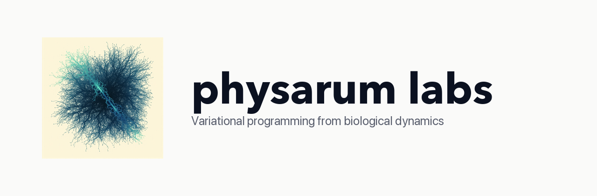

# physarum labs



[](https://opensource.org/licenses/MIT)
[](https://www.python.org/downloads/)
[](tests/)
[](https://arxiv.org/abs/2004.14539)

A clean MIT-licensed PyTorch implementation of Physarum-inspired
differentiable solvers, unifying four lines of recent research:

1. **Meng, Ravi, Singh (AAAI 2021)** — Differentiable LP layer via Physarum dynamics
2. **Solé & Pla-Mauri (arXiv Nov 2025)** — Lagrangian variational framework
3. **Schick et al. (PRX Life 2026)** — Peristaltic mechanism (substrate inspiration)
4. **Pietak & Levin (iScience 2025)** — Regulatory Network Machine paradigm

## What's here

- **`physarum_labs/lp.py`** — Clean MIT-licensed PyTorch reimplementation of the
  Physarum-inspired differentiable LP solver. Drop-in replacement for
  Sinkhorn-based optimal transport layers. **No Magic Leap license** — completely
  independent of the SuperGlue codebase.

- **`physarum_labs/variational.py`** — End-to-end `VariationalNetworkMachine`
  combining the LP solver with Solé's Lagrangian framework. Shows how to add
  transport dissipation, sparsity, and entropy regularization on top of the
  base solver, and how to learn edge affinities end-to-end.

- **`examples/cvxpy_comparison.py`** — Validates the Physarum solver against
  `scipy.optimize.linprog` on a range of problem sizes and iteration counts,
  and produces a convergence plot at `assets/convergence.png`.

## Why this exists

The only public working implementation of Meng 2021 lives inside the
`yingxin-jia/Superglue-with-Physarum-Dynamics` repository, which inherits
Magic Leap's **non-commercial academic use only** license. Anyone wanting
to commercialize Physarum Labs must reimplement — which is what this codebase
does, cleanly.

## Quick start

### Install via PyPI
```bash
pip install physarum-labs
```

### Install from source
```bash
git clone https://github.com/Physarum-Lab/physarum-labs
cd physarum-labs
pip install -e ".[dev]"  # includes scipy and matplotlib for benchmarks
```

### Run the demos
```bash
python -m physarum_labs.lp                # LP solver self-test
python -m physarum_labs.variational       # maze, matching, learning loop
python examples/cvxpy_comparison.py       # validates against scipy LP solver
```

### Run the tests
```bash
pytest tests/ -v
```

```python
import torch
from physarum_labs import PhysarumLPLayer

# Cost matrix (lower = better match)
scores = torch.rand(4, 5)
solver = PhysarumLPLayer(unmatch_score=-1.0, max_iter=20)
transport_plan, loss = solver(scores)

# transport_plan shape: (5, 6) — augmented with bin for unmatched
# transport_plan[:-1, :-1] gives the actual matching scores
```

## The algorithm

Physarum dynamics solve a doubly-stochastic optimal transport problem by
iteratively updating a flux vector:

```
x_{k+1} = (1 - h) * x_k + h * W * A^T * p
```

where `W = diag(x/c)`, `c` is the cost vector, `A` encodes row/column sum
constraints, and `p` solves `(A W A^T) p = 1`.

This is mathematically equivalent to a steepest-descent on the LP problem
(see Meng 2021), and to a least-action variational principle (see
Solé & Pla-Mauri 2025). It's also the same family of dynamics that
Pietak & Levin use to describe gene regulatory networks as analog computers.

## License

MIT. Use freely, including commercially.

## References

- Meng, Z., Ravi, S. N., & Singh, V. (2021). Physarum Powered Differentiable
  Linear Programming Layers and Applications. AAAI.
  arXiv:2004.14539

- Solé, R., & Pla-Mauri, J. (2025). Cognition as least action: the Physarum
  Lagrangian. arXiv:2511.08531

- Schick, L., et al. (2026). Decision-Making in Light-Trapped Slime Molds
  Involves Active Mechanical Processes. PRX Life. DOI: 10.1103/rv7g-d9kx

- Pietak, A., & Levin, M. (2025). Harnessing the analog computing power of
  regulatory networks with the Regulatory Network Machine. iScience.
  DOI: 10.1016/j.isci.2025.112536

- Bajpai, S., Lucas-DeMott, A., Murugan, N. J., Levin, M., & Kurian, P.
  (2025). Morphological computational capacity of Physarum polycephalum.
  arXiv:2510.19976